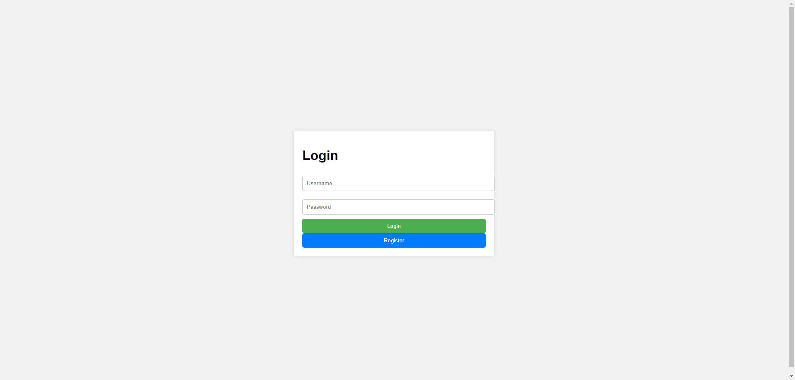
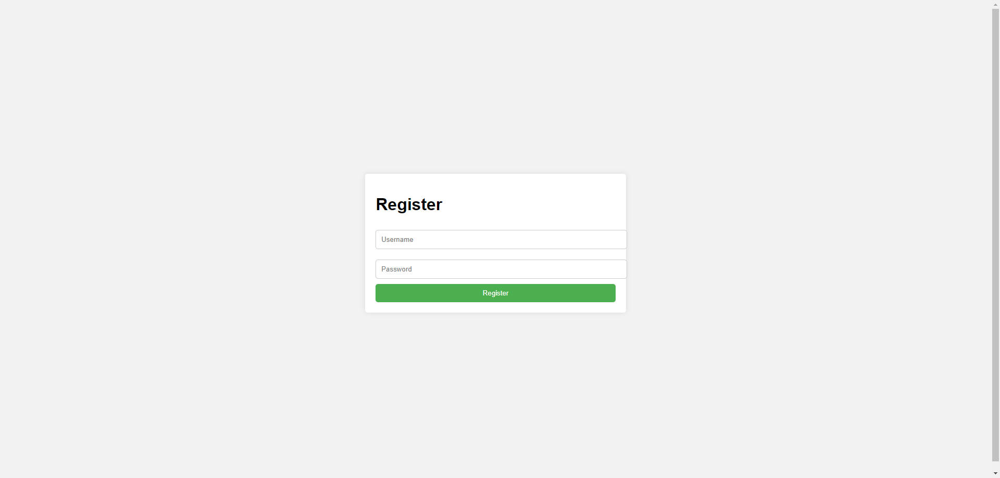
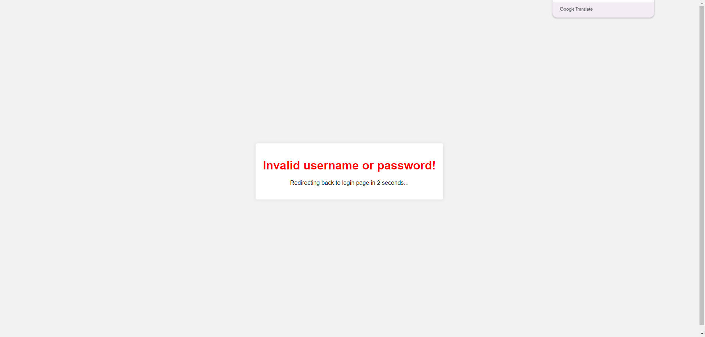
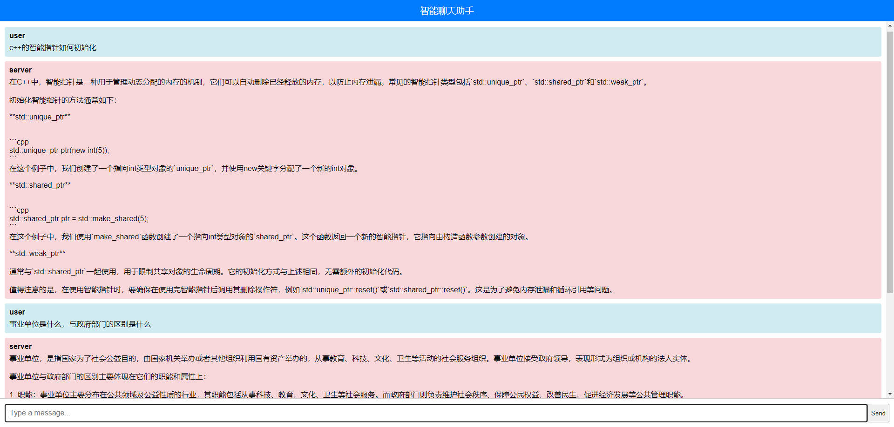

# GPTWebServer

## 项目简介
这是一个简单的聊天网页应用程序，包含登录、注册、聊天功能，并且处理登录失败和注册失败的情况。以下是项目的主要功能和页面截图。

## 功能列表
- 用户登录
- 用户注册
- 聊天功能
- 登录失败提示
- 注册失败提示

## 项目结构
.
├── build
├── CMakeLists.txt
├── db
│   ├── db.cpp
│   └── db.h
├── gpt
│   ├── gpt.py
│   └── wenxin.py
├── http
│   ├── http_conn.cpp
│   └── http_conn.h
├── include
│   └── json.hpp
├── lock
│   └── locker.h
├── log
│   ├── blocking_queue_back.h
│   ├── blocking_queue.h
│   ├── log.cpp
│   └── log.h
├── main.cpp
├── parse_arg.cpp
├── parse_arg.h
├── README.md
├── resources
│   ├── images
│   │   ├── image1.jpg
│   │   ├── 密码错误.jpg
│   │   ├── 注册页面.jpg
│   │   ├── 登录界面.jpg
│   │   └── 聊天页面.jpg
│   ├── index.html
│   ├── login_failed.html
│   ├── login.html
│   ├── register.html
│   ├── regist_success.html
│   └── welcome.html
├── structure.txt
├── test_presure
├── threadpool
│   └── threadpool.h
├── timer
│   ├── lst_timer.cpp
│   └── lst_timer.h
├── webserver.cpp
└── webserver.h

## 页面展示

### 登录页面

- 用户可以在此页面输入用户名和密码进行登录。

### 注册页面

- 新用户可以在此页面输入相关信息进行注册。

### 登录失败页面

- 当用户输入错误的用户名或密码时，显示登录失败提示。

### 聊天页面

- 用户登录后，可以在此页面进行聊天。
